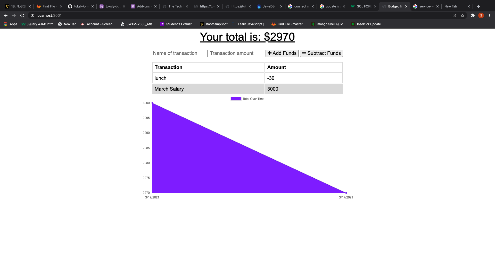

# Budget-Tracker
<strong>Budget-Traker</strong>
The name of this application is <i>Budget Tracker</i> it is designed to make it fast and easy for its users to track how they spend their money.

<strong>Image</strong>

<strong>Description</strong>
This application allows its users to be able to track their their deposit and withdrawals without a data and internet connection.
<strong>Technology used</strong>
 Javascript,service walker, and node.js . 

<strong>Installation</strong>

This project does not need any installation,rather it is currently hosted at Heroku
<strong>Usage</strong>

The application is easy to use. It allows the user to be able to be able to track their spending.

<strong>Support and Contribution</strong>
If you have any question please email me at nwizutoks@gmail.com
